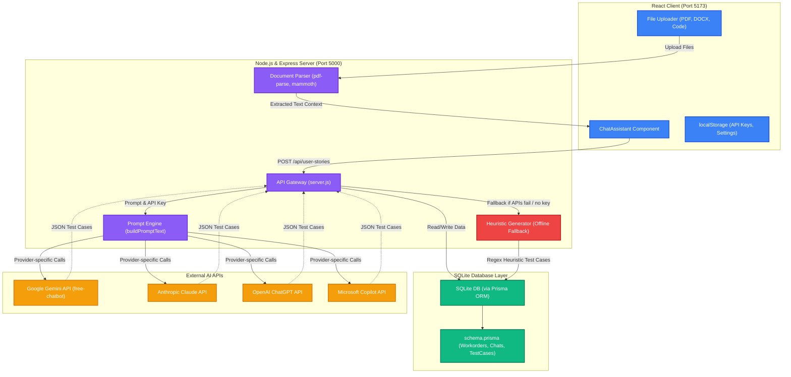
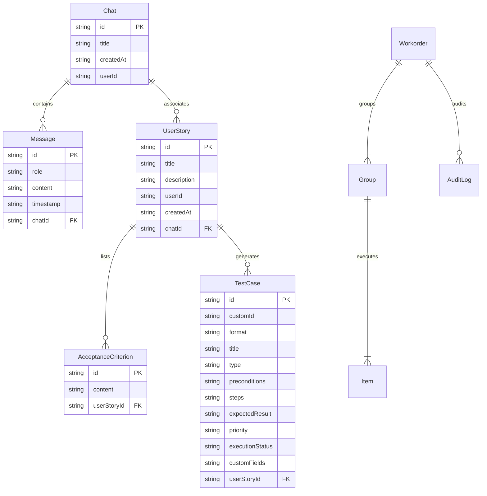

# QAtlas Architecture Documentation

This document describes the system architecture, database models, and communication flows of the QAtlas QA Test Case Generator.

## 1. System Architecture Diagram

Below is the high-level architecture diagram showing the relationship between the React frontend, the Node.js Express backend, the SQLite database layer (via Prisma), and the external AI service integrations.

---

## 2. Component Directory Structure

The repository is divided into two primary workspaces: the React client and the Express server.

*   [start-qatlas.bat](file:///C:/Users/saksham.asati/.gemini/antigravity/scratch/start-qatlas.bat): Startup script configured to spawn both servers concurrently.
*   **React Frontend** [ai-assistant](file:///C:/Users/saksham.asati/.gemini/antigravity/scratch/ai-assistant):
    *   [App.jsx](file:///C:/Users/saksham.asati/.gemini/antigravity/scratch/ai-assistant/src/App.jsx): Root entry point rendering the main UI.
    *   [ChatAssistant.jsx](file:///C:/Users/saksham.asati/.gemini/antigravity/scratch/ai-assistant/src/ChatAssistant.jsx): Orchestrates settings, chat logs, repositories, exports, and manual execution dry-runs.
*   **Express Backend** [workflow-backend](file:///C:/Users/saksham.asati/.gemini/antigravity/scratch/workflow-backend):
    *   [server.js](file:///C:/Users/saksham.asati/.gemini/antigravity/scratch/workflow-backend/server.js): API routing, LLM API client interfaces, local heuristic failover, and PDF/DOCX document text extraction.
    *   [schema.prisma](file:///C:/Users/saksham.asati/.gemini/antigravity/scratch/workflow-backend/prisma/schema.prisma): SQLite structural schema definition.

---

## 3. Database Schema Layout

The relational mapping defined in [schema.prisma](file:///C:/Users/saksham.asati/.gemini/antigravity/scratch/workflow-backend/prisma/schema.prisma) handles two distinct workflows: **Workorder Records Execution** and **AI Chat Test Case Generation**.

---

## 4. Key AI Processing Workflows

### 4.1 Test Case Generation Flow
1. **User Requirement Input**: The QA Engineer enters a user story, acceptance criteria, selects the output format (`Default`, `LLY TU`, `LLY PBPA`, `DEL`), and specifies test type ratios.
2. **Context Enrichment**: Uploaded attachments are read. The backend extracts text using `pdf-parse` (for PDFs) or `mammoth` (for Word documents) and appends this as document context.
3. **API Routing**: The frontend forwards the selected provider settings (Gemini, ChatGPT, Claude, Copilot) and API key in headers to the Express server.
4. **Prompt Construction**: `buildPromptText()` injects quality instructions (Boundary Value Analysis, Equivalence Partitioning), the target JSON schema layout, and details of existing test cases to prevent duplication.
5. **Execution & Storage**: The chosen LLM parses the prompt and generates structured JSON test cases. The server creates entries in the database and returns them to the React client.

### 4.2 Offline Fallback Mechanism
If the AI API fails (due to key expiration, rate limits, or network connectivity issues) or if the user requests heuristic generation:
1. The Express route catches the rejection and routes to `generateMockTestCases()`.
2. Heuristics extract common entities (e.g. Buttons, Inputs, Navigation links) from the requirement text using RegExp.
3. Template test cases covering typical actions (e.g. "Click Button", "Validate Input boundaries") are generated.
4. The test cases are saved in the sqlite database and returned to the UI marked with custom formats, ensuring zero-interruption workflow for the QA engineer.
